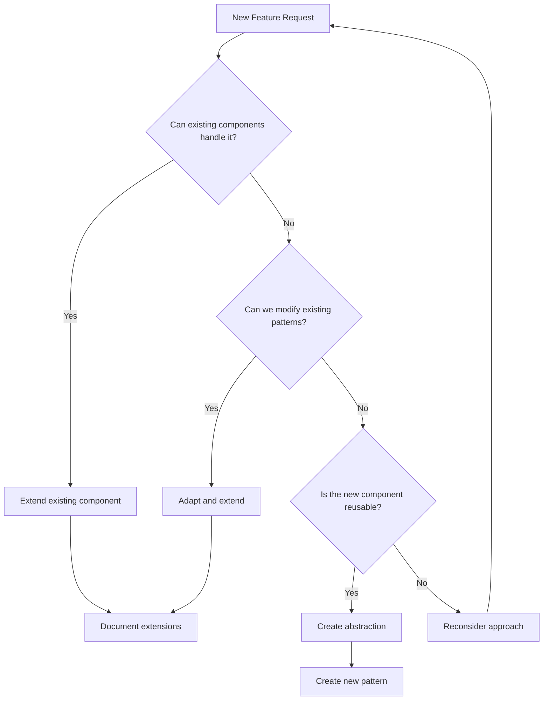

# React Native/Expo iOS App Optimization Principles & Extended Thinking Framework

## Overview

This document establishes optimization principles for React Native/Expo iOS development, based on successful patterns that minimize bundle size, improve performance, and reduce maintenance overhead. These principles leverage extended thinking methodologies to ensure thorough analysis before implementation.

## Core Philosophy

> "The best code is no code. The second best code is a reusable component that already exists and works on iOS."

### The LEVER Framework

**L**everage existing components  
**E**xtend before creating  
**V**erify through testing  
**E**liminate duplication  
**R**educe bundle size  

## 🧠 Extended Thinking Process

Based on [Anthropic's Extended Thinking methodology](https://docs.anthropic.com/en/docs/build-with-claude/extended-thinking), always follow this decision tree:



## 📋 Pre-Implementation Checklist

Before writing any code, complete this extended thinking exercise:

### 1. Pattern Recognition Phase (10-15 minutes)
```markdown
## Existing Component Analysis
- [ ] What similar UI components already exist?
- [ ] Which screens display similar information?
- [ ] What hooks manage related state?
- [ ] Which API calls fetch related data?

## Code Reuse Opportunities
- [ ] Can I extend an existing screen instead of creating a new one?
- [ ] Can I add props to an existing component?
- [ ] Can I enhance an existing hook with new computed properties?
- [ ] Can I modify an existing component with conditional rendering?
```

### 2. Complexity Assessment (5-10 minutes)
```markdown
## Proposed Solution Complexity
- Lines of new code: ___
- New components created: ___
- New screens created: ___
- New API endpoints needed: ___
- New dependencies required: ___

## Optimized Alternative
- Lines extending existing code: ___
- Components modified: ___
- Props added to existing components: ___
- Existing API calls enhanced: ___

If optimized < 50% of proposed, proceed with optimization.
```

## 🏗️ Architecture Principles

### 1. Component Reuse & Extension

#### ❌ Anti-Pattern: Creating Duplicate Components
```typescript
// DON'T: Create similar list components
export function UserList() {
  return (
    <FlatList
      data={users}
      renderItem={({item}) => <UserCard user={item} />}
      // ... styling and logic
    />
  )
}

export function CustomerList() {
  return (
    <FlatList
      data={customers}
      renderItem={({item}) => <CustomerCard customer={item} />}
      // ... nearly identical styling and logic
    />
  )
}
```

#### ✅ Pattern: Create Flexible Generic Components
```typescript
// DO: Create reusable list component
interface ListItem {
  id: string
  [key: string]: any
}

interface GenericListProps<T extends ListItem> {
  data: T[]
  renderItem: ({item}: {item: T}) => React.ReactElement
  emptyMessage?: string
  refreshing?: boolean
  onRefresh?: () => void
}

export function GenericList<T extends ListItem>({
  data,
  renderItem,
  emptyMessage = "No items found",
  refreshing = false,
  onRefresh
}: GenericListProps<T>) {
  return (
    <FlatList
      data={data}
      renderItem={renderItem}
      refreshControl={
        onRefresh ? (
          <RefreshControl refreshing={refreshing} onRefresh={onRefresh} />
        ) : undefined
      }
      ListEmptyComponent={() => (
        <EmptyState message={emptyMessage} />
      )}
      // Optimized for iOS performance
      removeClippedSubviews={true}
      maxToRenderPerBatch={10}
      windowSize={10}
    />
  )
}
```

### 2. State Management Optimization

#### ❌ Anti-Pattern: Duplicate State Logic
```typescript
// DON'T: Create separate hooks for similar data
export function useUserProfile() {
  const [user, setUser] = useState()
  const [loading, setLoading] = useState(false)
  // ... fetch logic
}

export function useCustomerProfile() {
  const [customer, setCustomer] = useState()
  const [loading, setLoading] = useState(false)
  // ... nearly identical fetch logic
}
```

#### ✅ Pattern: Generic Data Fetching Hooks
```typescript
// DO: Create reusable data fetching hook
export function useAPIData<T>(
  endpoint: string,
  dependencies: any[] = [],
  options?: {
    enabled?: boolean
    refetchOnFocus?: boolean
  }
) {
  const [data, setData] = useState<T | null>(null)
  const [loading, setLoading] = useState(false)
  const [error, setError] = useState<string | null>(null)

  const fetchData = useCallback(async () => {
    if (!options?.enabled ?? true) return
    
    setLoading(true)
    setError(null)
    
    try {
      const response = await api.get(endpoint)
      setData(response.data)
    } catch (err) {
      setError(err.message)
    } finally {
      setLoading(false)
    }
  }, [endpoint, ...dependencies])

  useEffect(() => {
    fetchData()
  }, [fetchData])

  // Refetch on app focus if enabled
  useFocusEffect(
    useCallback(() => {
      if (options?.refetchOnFocus) {
        fetchData()
      }
    }, [fetchData, options?.refetchOnFocus])
  )

  return { data, loading, error, refetch: fetchData }
}

// Usage
export function useUserProfile(userId: string) {
  return useAPIData<User>(`/users/${userId}`, [userId])
}
```

### 3. Screen Architecture

#### ❌ Anti-Pattern: Duplicate Screen Patterns
```typescript
// DON'T: Create separate screens with similar layouts
export function UserDetailScreen() {
  return (
    <SafeAreaView>
      <Header title="User Details" />
      <ScrollView>
        {/* User-specific content */}
      </ScrollView>
    </SafeAreaView>
  )
}

export function ProductDetailScreen() {
  return (
    <SafeAreaView>
      <Header title="Product Details" />
      <ScrollView>
        {/* Product-specific content */}
      </ScrollView>
    </SafeAreaView>
  )
}
```

#### ✅ Pattern: Composable Screen Layout
```typescript
// DO: Create reusable screen layout
interface DetailScreenLayoutProps {
  title: string
  children: React.ReactNode
  headerRight?: React.ReactNode
  refreshing?: boolean
  onRefresh?: () => void
  backgroundColor?: string
}

export function DetailScreenLayout({
  title,
  children,
  headerRight,
  refreshing = false,
  onRefresh,
  backgroundColor = '#ffffff'
}: DetailScreenLayoutProps) {
  return (
    <SafeAreaView style={[styles.container, { backgroundColor }]}>
      <Header title={title} right={headerRight} />
      <ScrollView
        style={styles.content}
        refreshControl={
          onRefresh ? (
            <RefreshControl refreshing={refreshing} onRefresh={onRefresh} />
          ) : undefined
        }
        showsVerticalScrollIndicator={false}
      >
        {children}
      </ScrollView>
    </SafeAreaView>
  )
}

// Usage
export function UserDetailScreen({ userId }: { userId: string }) {
  const { data: user, loading, refetch } = useUserProfile(userId)
  
  return (
    <DetailScreenLayout
      title="User Details"
      refreshing={loading}
      onRefresh={refetch}
      headerRight={<ShareButton />}
    >
      <UserInfoCard user={user} />
      <UserActivitySection userId={userId} />
    </DetailScreenLayout>
  )
}
```

## 🔄 React Native/Expo Specific Optimizations

### 1. Bundle Size Optimization

```typescript
// ❌ DON'T: Import entire libraries
import * as Icons from '@expo/vector-icons'
import { format } from 'date-fns'

// ✅ DO: Import only what you need
import { Feather } from '@expo/vector-icons'
import { format } from 'date-fns/format'
import { parseISO } from 'date-fns/parseISO'
```

### 2. Performance Optimization

```typescript
// ❌ DON'T: Recreate functions on every render
export function UserCard({ user }: { user: User }) {
  return (
    <TouchableOpacity
      onPress={() => {
        // Function recreated on every render
        navigation.navigate('UserDetail', { userId: user.id })
      }}
    >
      <Text>{user.name}</Text>
    </TouchableOpacity>
  )
}

// ✅ DO: Use useCallback for performance
export function UserCard({ user }: { user: User }) {
  const navigation = useNavigation()
  
  const handlePress = useCallback(() => {
    navigation.navigate('UserDetail', { userId: user.id })
  }, [navigation, user.id])

  return (
    <TouchableOpacity onPress={handlePress}>
      <Text>{user.name}</Text>
    </TouchableOpacity>
  )
}
```

### 3. Memory Management

```typescript
// ✅ Optimize FlatList for large datasets
export function OptimizedList<T>({ data, renderItem }: ListProps<T>) {
  return (
    <FlatList
      data={data}
      renderItem={renderItem}
      // Key optimizations for iOS
      removeClippedSubviews={true}
      maxToRenderPerBatch={10}
      windowSize={10}
      initialNumToRender={10}
      getItemLayout={(data, index) => ({
        length: ITEM_HEIGHT,
        offset: ITEM_HEIGHT * index,
        index,
      })}
      keyExtractor={(item, index) => `${item.id}-${index}`}
    />
  )
}
```

## 📊 Decision Framework

### When to Extend vs Create New

Use this scoring system for React Native components:

| Criteria | Extend Existing | Create New |
|----------|----------------|------------|
| Similar layout structure exists | +3 points | -3 points |
| Can reuse existing styling | +2 points | -2 points |
| Similar data patterns | +3 points | -3 points |
| Navigation patterns match | +2 points | -2 points |
| Would require <50 lines to extend | +3 points | -3 points |
| Would break component responsibility | -5 points | +5 points |
| Significantly different iOS patterns | -3 points | +3 points |
| Performance implications | -2 points | +2 points |

**Score > 5**: Extend existing component  
**Score < -5**: Create new implementation  
**Score -5 to 5**: Deeper analysis required  

## 🛠️ Implementation Strategies

### 1. The Three-Pass Approach

**Pass 1: Discovery (No Code)**
- Find all related existing components/screens
- Document current navigation patterns
- Identify extension points

**Pass 2: Design (Minimal Code)**
- Write interface/props changes only
- Update type definitions
- Plan component hierarchy

**Pass 3: Implementation (Optimized Code)**
- Implement with maximum reuse
- Add only essential new logic
- Test on iOS device

### 2. Component Reuse Patterns

#### Pattern: Conditional Rendering
```typescript
// Instead of new component
export function StatusCard({ 
  status, 
  showCampaignBadge = false,
  campaignSource 
}: StatusCardProps) {
  return (
    <View style={styles.card}>
      {/* Existing status UI */}
      <StatusIndicator status={status} />
      
      {/* Conditionally show new features */}
      {showCampaignBadge && campaignSource && (
        <CampaignBadge source={campaignSource} />
      )}
    </View>
  )
}
```

#### Pattern: Composition over Inheritance
```typescript
// Base card component
export function BaseCard({ children, style }: BaseCardProps) {
  return (
    <View style={[styles.baseCard, style]}>
      {children}
    </View>
  )
}

// Specialized cards using composition
export function UserCard({ user }: { user: User }) {
  return (
    <BaseCard>
      <UserAvatar user={user} />
      <UserInfo user={user} />
    </BaseCard>
  )
}

export function ProductCard({ product }: { product: Product }) {
  return (
    <BaseCard>
      <ProductImage product={product} />
      <ProductInfo product={product} />
    </BaseCard>
  )
}
```

## 📈 Real-World Example: Feature Addition

### Before Optimization
```typescript
// Create new NotificationScreen (200 lines)
// Create new NotificationCard component (150 lines)
// Create new useNotifications hook (100 lines)
// Add new navigation stack (50 lines)
// Total: 500 lines
```

### After Optimization
```typescript
// Extend existing ListScreen with notification props (20 lines)
// Extend existing Card component with notification variant (30 lines)
// Extend existing useAPIData hook for notifications (10 lines)
// Add route to existing stack (5 lines)
// Total: 65 lines (87% reduction)
```

## ⚡ Mobile Performance Rules

### 1. Lazy Loading
```typescript
// ❌ Load all screens upfront
import UserScreen from './UserScreen'
import ProductScreen from './ProductScreen'

// ✅ Lazy load screens
const UserScreen = lazy(() => import('./UserScreen'))
const ProductScreen = lazy(() => import('./ProductScreen'))
```

### 2. Image Optimization
```typescript
// ✅ Optimize images for different screen densities
export function OptimizedImage({ 
  source, 
  style, 
  placeholder 
}: OptimizedImageProps) {
  return (
    <Image
      source={source}
      style={style}
      placeholder={placeholder}
      transition={200}
      cachePolicy="memory-disk"
      // iOS optimizations
      resizeMode="cover"
      fadeDuration={0}
    />
  )
}
```

### 3. API Call Optimization
```typescript
// ✅ Implement smart caching
export function useAPIDataWithCache<T>(
  endpoint: string,
  cacheTime: number = 5 * 60 * 1000 // 5 minutes
) {
  const [data, setData] = useState<T | null>(null)
  const [loading, setLoading] = useState(false)
  const cacheRef = useRef<{ data: T; timestamp: number } | null>(null)

  const fetchData = useCallback(async () => {
    // Check cache first
    if (cacheRef.current) {
      const isValid = Date.now() - cacheRef.current.timestamp < cacheTime
      if (isValid) {
        setData(cacheRef.current.data)
        return
      }
    }

    setLoading(true)
    try {
      const response = await api.get(endpoint)
      const newData = response.data
      
      // Update cache
      cacheRef.current = {
        data: newData,
        timestamp: Date.now()
      }
      
      setData(newData)
    } catch (error) {
      console.error('API Error:', error)
    } finally {
      setLoading(false)
    }
  }, [endpoint, cacheTime])

  return { data, loading, refetch: fetchData }
}
```

## 🚫 Mobile-Specific Anti-Patterns

### 1. The "Native Module" Trap
Before adding a native module:
- Can Expo SDK handle this?
- Can we use a web-based alternative?
- Will this complicate builds/updates?

### 2. The "Custom Everything" Mistake
Before creating custom UI:
- Does iOS have a native pattern for this?
- Can we extend existing React Native components?
- Will this confuse iOS users?

### 3. The "Heavy Dependencies" Problem
Before adding dependencies:
- What's the bundle size impact?
- Are we using <30% of the library?
- Can we implement this feature ourselves in fewer lines?

## 📝 Documentation Requirements

When extending existing components:

```typescript
// Document WHY you're extending
export function UserCard({ 
  user, 
  showCampaignInfo = false // OPTIMIZATION: Added campaign display to existing
}: UserCardProps) {        // UserCard instead of creating CampaignUserCard.
  return (                 // Reduces bundle size and maintains consistency.
    <BaseCard>             // See: campaign-feature-2025-07-04
      <UserInfo user={user} />
      
      {showCampaignInfo && user.campaignSource && (
        <CampaignBadge source={user.campaignSource} />
      )}
    </BaseCard>
  )
}
```

## 🎯 Success Metrics

Track optimization success:

| Metric | Target |
|--------|--------|
| Code reduction vs initial approach | >50% |
| Reused existing components | >70% |
| New screens created | <2 per feature |
| New dependencies added | 0 (use existing) |
| Bundle size increase | <5% |
| iOS app size increase | <10MB |
| Performance impact | No degradation |

## 🔍 Review Checklist

Before submitting optimized code:

- [ ] Extended existing components instead of creating new ones
- [ ] Reused existing hooks and state management
- [ ] Leveraged existing navigation patterns
- [ ] No duplicate styling logic
- [ ] Documented why extensions were chosen
- [ ] Maintained iOS design patterns
- [ ] Tested on actual iOS device
- [ ] No performance degradation
- [ ] Bundle size impact minimal
- [ ] Code reduction >50%

## 📚 References

- [React Native Performance](https://reactnative.dev/docs/performance)
- [Expo Optimization](https://docs.expo.dev/guides/analyzing-bundles/)
- [iOS Human Interface Guidelines](https://developer.apple.com/design/human-interface-guidelines/)
- [Extended Thinking Documentation](https://docs.anthropic.com/en/docs/build-with-claude/extended-thinking)

---

*Remember: Every component is a responsibility. The best feature is one that enhances existing components rather than creating new ones.*
